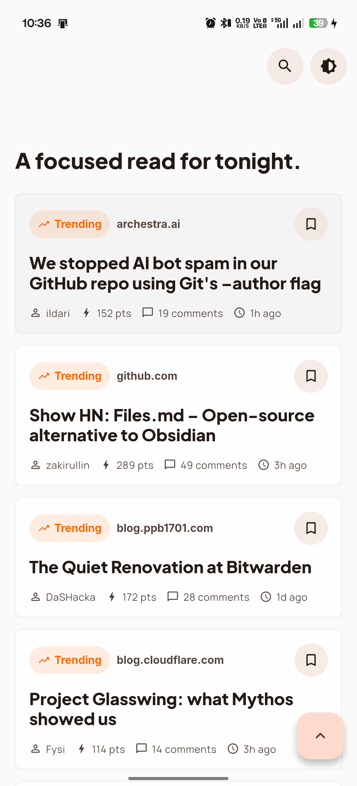
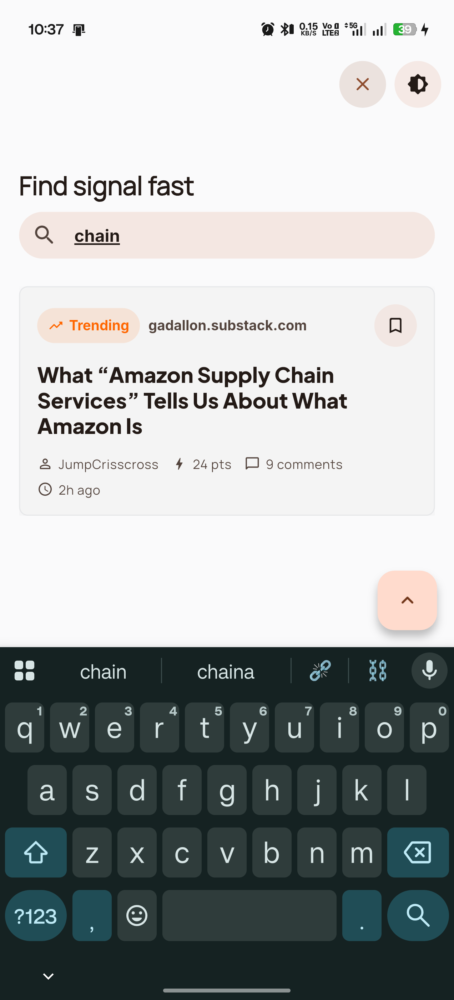
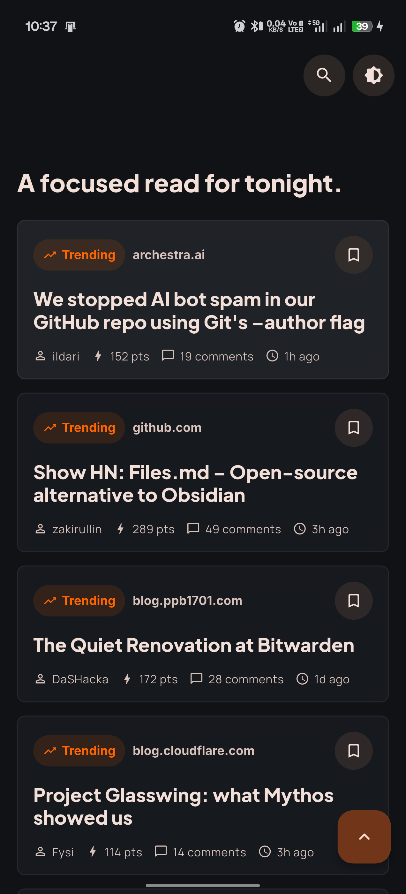
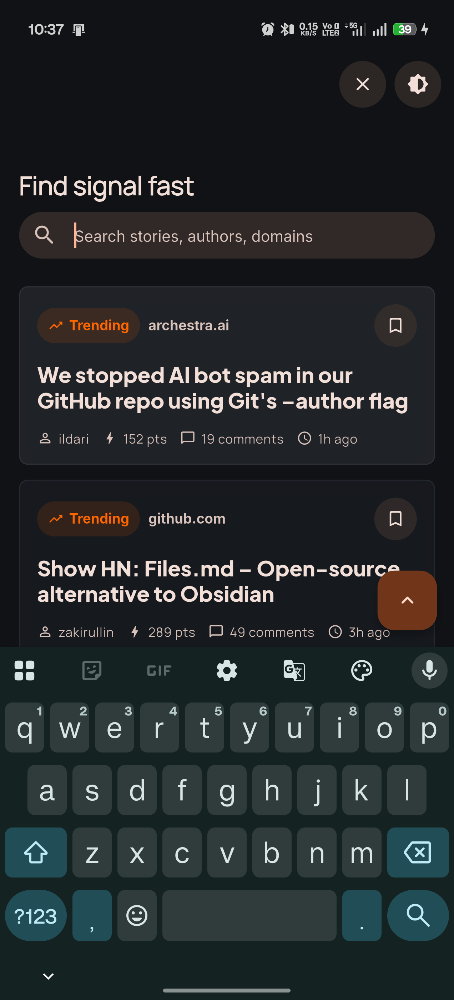
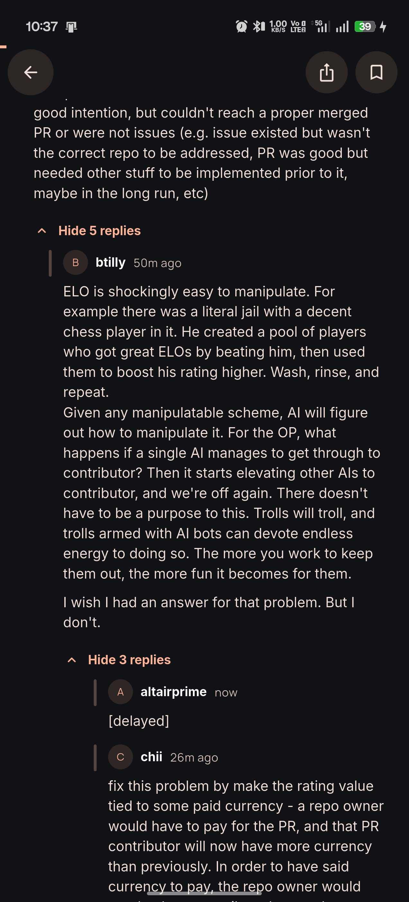
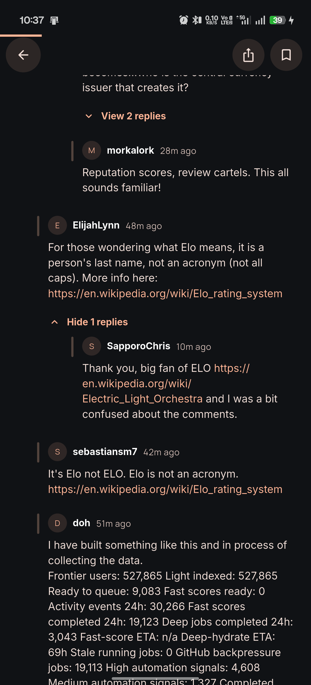
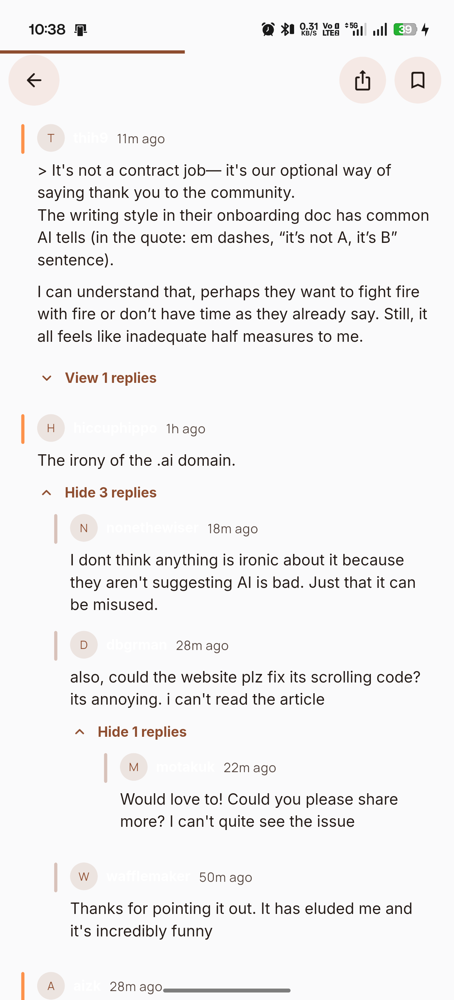

# Signal HN

A polished Hacker News reader built with Flutter. Signal HN focuses on a fast reading experience, clean architecture, smooth scrolling, typed error handling, and a scalable feature-first codebase.

The app loads top Hacker News stories from the official Firebase API, supports pagination and pull-to-refresh, opens story detail pages, renders nested comments, and keeps lightweight in-memory state for read and saved stories.

## APK Download

You can download and install the Android APK from Google Drive:

[Download Signal HN APK](https://drive.google.com/file/d/11QG2bzSRwdM-1tt068uKdpnAJ74SXDBM/view?usp=drive_link)

## Screenshots

| Home | Search | Story Detail |
| --- | --- | --- |
|  |  |  |

| Comments | Dark Mode | Saved State |
| --- | --- | --- |
|  |  |  |

| Article Actions | Discussion | Loading State |
| --- | --- | --- |
|  |  |  |

## Features

- Top Hacker News story feed
- Infinite scrolling with paginated loading
- Pull-to-refresh
- Search across loaded stories by title, author, and domain
- Story detail route with direct `/story/:id` loading
- Recursive nested comment threads
- Lazy reply loading when a thread is expanded
- Save/bookmark stories from home or detail
- Read-state marking when a story is opened
- Share story links
- Open article and Hacker News discussion links externally
- Light and dark theme support
- Shimmer skeleton loading states
- Reusable empty, error, badge, metadata, and icon-button widgets

## Tech Stack

- Flutter and Dart
- `flutter_bloc` for state management
- `go_router` for declarative routing
- `dio` for API requests
- `get_it` for dependency injection
- `equatable` for value equality
- `flutter_html` for story/comment HTML rendering
- `url_launcher` for external links
- `share_plus` for sharing
- `google_fonts` for typography
- `shimmer` and `flutter_animate` for loading and motion polish

## API

Signal HN uses the official Hacker News Firebase API:

```text
Top stories:
https://hacker-news.firebaseio.com/v0/topstories.json

Item detail:
https://hacker-news.firebaseio.com/v0/item/<id>.json
```

Stories and comments are both returned as HN items. Story `kids` are mapped to root comment IDs, while comment `kids` are mapped to reply IDs.

## Architecture

The project follows a feature-first clean architecture style.

```text
lib/
  core/
    animations/
    constants/
    errors/
    extensions/
    network/
    services/
    theme/
    utils/
    widgets/

  features/
    home/
      data/
      domain/
      presentation/

    detail/
      data/
      domain/
      presentation/

  routes/
  app.dart
  injection_container.dart
  main.dart
```

## Layer Responsibilities

`core` contains shared infrastructure such as networking, failures, result wrappers, theme, reusable widgets, extensions, animations, and platform services.

`data` contains remote data sources, API parsing, model classes, and repository implementations.

`domain` contains entities, repository contracts, and use cases. This layer stays independent from Flutter widgets.

`presentation` contains pages, widgets, and BLoCs. UI state is driven by immutable state objects and feature events.

## Project Flow

When the app starts, `main.dart` initializes Flutter bindings, configures dependency injection through `injection_container.dart`, and runs `HackerNewsApp`.

`HackerNewsApp` sets up global providers for theme state and the home feed BLoC. The app uses `MaterialApp.router`, so navigation is handled by `go_router` in `app_router.dart`.

The home feature loads top story IDs from Hacker News, fetches story details page by page, filters invalid/deleted items, and renders the feed through `HomePage` and `StoryCard` widgets.

The detail feature opens a selected story, loads its root comments, and fetches nested replies only when the user expands a thread. This avoids downloading large discussions upfront and keeps the UI responsive.

## Data Flow

```text
UI Widget
  -> BLoC Event
  -> Use Case
  -> Repository Contract
  -> Repository Implementation
  -> Remote Data Source
  -> ApiClient / Hacker News API
  -> Model
  -> Entity
  -> BLoC State
  -> UI Widget
```

This separation keeps API logic, business rules, and UI rendering independent. It also makes the app easier to test and extend because each feature owns its own data, domain, and presentation layers.

## Important Files

- `lib/main.dart` - app entry point
- `lib/app.dart` - root app widget and global BLoC providers
- `lib/injection_container.dart` - GetIt dependency setup
- `lib/routes/app_router.dart` - app routes
- `lib/core/network/api_client.dart` - Dio client and API exception mapping
- `lib/core/theme/app_theme.dart` - light and dark themes
- `lib/features/home/presentation/bloc/` - home feed state management
- `lib/features/detail/presentation/bloc/` - detail/comment state management
- `lib/features/detail/presentation/widgets/comment_thread.dart` - recursive comment UI

## State Management

`HomeBloc` handles initial story loading, refresh, pagination, search, read state, saved story IDs, and home screen status states.

`DetailBloc` handles root comment loading, reply expansion/collapse, lazy reply fetching, and per-thread reply loading state. Replies are grouped by parent comment ID:

```dart
Map<int, List<Comment>> repliesByParent;
```

This keeps large discussions responsive because replies are fetched only when the user expands a thread.

## Getting Started

### Prerequisites

- Flutter stable SDK
- Dart SDK compatible with the `pubspec.yaml` SDK constraint
- Android Studio, VS Code, or another Flutter-capable editor

Check your Flutter setup:

```bash
flutter doctor
```

Install dependencies:

```bash
flutter pub get
```

Run the app:

```bash
flutter run
```

Run on Chrome:

```bash
flutter run -d chrome
```

## Quality Checks

Format the project:

```bash
dart format lib test
```

Analyze Dart code:

```bash
dart analyze lib
```

Run tests:

```bash
flutter test
```

Build for web:

```bash
flutter build web
```

## Current Limitations

- Search filters only stories already loaded into the feed.
- Saved and read state is in memory only and resets after app restart.
- The app depends on the public Hacker News Firebase API.
- Large comment threads are loaded incrementally instead of all at once.

## Possible Improvements

- Persist saved/read state with local storage or HydratedBloc
- Add an offline cache for stories and comments
- Add Algolia Hacker News search for full remote search
- Add BLoC and repository unit tests
- Add golden tests for major UI states
- Add a dedicated saved stories screen
- Add comment sorting and collapse-all controls
